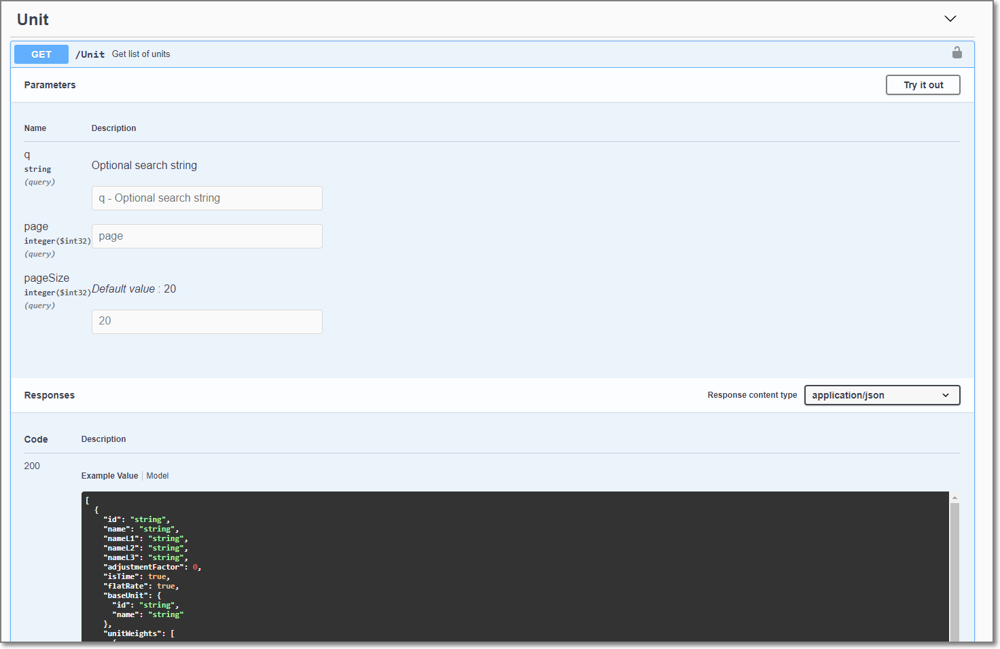
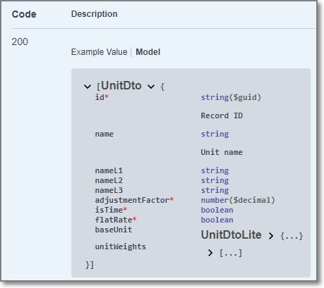

# How to read data using API #

First of all, it is recommended to open API documentation (via URL where you have installed API website, or using example API website: https://api.ibaccs.com). In the list you can find a lot of endpoints supported by API. Eech endpoint has a label identifying type of request which should be send to that endpoint. GET requests are used only to read data, while POST requests allow to create data, PATCH - to edit data, and DELETE - to delete data. In this article, we're going to descirbe **GET** requests.

For example, you're going to read simple list of Units. Let's expand **Unit** group and find endpoint which allows to read list of units:



In the **Example value** group you can see the structure of returned rows. If you switch to the **Model** tab, you will find detailed description of fields of the Units table:


By following this model, you can re-create a class in your application for de-serialization of the Unit objects. It could look like this:

   ```cs
   public class UnitDto
    {
        [Description("Record ID")]
        public Guid Id { get; set; }
        [Description("Unit name")]
        public string Name { get; set; }
        public string NameL1 { get; set; }
        public string NameL2 { get; set; }
        public string NameL3 { get; set; }
        public decimal AdjustmentFactor { get; set; }
        public bool IsTime { get; set; }
        public bool FlatRate { get; set; }
        public UnitDtoLite BaseUnit { get; set; }
        [Description("Unit weights")]
        public List<UnitWeightItemDto> UnitWeights { get; set; }
    }

    public class UnitDtoLite
    {
        [Description("Record ID")]
        public Guid Id { get; set; }
        [Description("Unit name")]
        public string Name { get; set; }
    }

	public class UnitWeightItemDto
    {
        [Description("Record ID")]
        public Guid Id { get; set; }
        [Description("Unit")]
        public UnitDtoLite Unit { get; set; }
        [Description("Service type")]
        public ServiceTypeDtoLite ServiceType { get; set; }
        [Description("Fuzzy weight")]
        public decimal AdjustmentFactor { get; set; }
    }
   ```

Now, when you have necessary classes and access token, you can send a request and get de-serializaed list of units:

   ````cs
   var client = new RestClient("https://localhost:44334/Unit");
   var request = new RestRequest(Method.GET);
   request.AddHeader("Authorization", "Bearer your_token");
   IRestResponse response = client.Execute(request);
   try
   {
		var units = JsonConvert.DeserializeObject<UnitDto[]>(response);
   }
   catch(Exception e)
   {
		...
   }
   ````

In the same manner, you can create model classes for other entities (for example, translation job has much more fields, so it won't be a quick job), and use them to retrieve data from other endpoints.